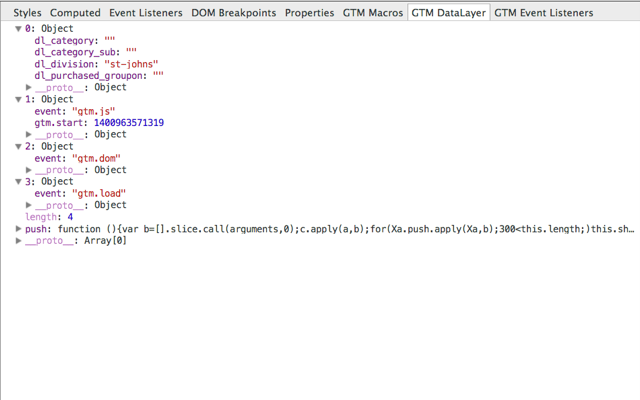

# GTM DevTools Sidebar Panes
Google Chrome extension which displays Google Tag Manager sidebar panes in Chrome Developer Tools.

## Usage
This extension will add two sidebar panes to the elements panel of Chrome Developer Tools. You can use this extension to debug or check the macros inside the Google Tag Manager object of the current page.

The GTM Macros pane shows all available macros including the latest event tracking data when available:

The GTM Datalayer pane gives easy access to the objects inside the dataLayer:

Both panes will be updated by clicking DOM elements inside the elements panel.

## Install
Download and install this extension from the [Chrome Web Store][1]

## Issues
Have a bug? Please create an [issue][2] here on GitHub!

## Contributing
Want to contribute? Great! Just fork the project, make your changes and open a [pull request][3]

## Changelog
### 0.1 (May 12, 2014):
 * Initial release.

## License
Licensed under the MIT license.

Copyright (c) 2014 [Sander Heilbron][4]

Permission is hereby granted, free of charge, to any person obtaining a copy
of this software and associated documentation files (the "Software"), to deal
in the Software without restriction, including without limitation the rights
to use, copy, modify, merge, publish, distribute, sublicense, and/or sell
copies of the Software, and to permit persons to whom the Software is
furnished to do so, subject to the following conditions:

The above copyright notice and this permission notice shall be included in
all copies or substantial portions of the Software.

THE SOFTWARE IS PROVIDED "AS IS", WITHOUT WARRANTY OF ANY KIND, EXPRESS OR
IMPLIED, INCLUDING BUT NOT LIMITED TO THE WARRANTIES OF MERCHANTABILITY,
FITNESS FOR A PARTICULAR PURPOSE AND NONINFRINGEMENT. IN NO EVENT SHALL THE
AUTHORS OR COPYRIGHT HOLDERS BE LIABLE FOR ANY CLAIM, DAMAGES OR OTHER
LIABILITY, WHETHER IN AN ACTION OF CONTRACT, TORT OR OTHERWISE, ARISING FROM,
OUT OF OR IN CONNECTION WITH THE SOFTWARE OR THE USE OR OTHER DEALINGS IN
THE SOFTWARE.

[1]: https://chrome.google.com/webstore/detail/gtm-devtools-sidebar-pane/nlpchkkljkimifenglmblhnklbngejfh
[2]: https://github.com/sanderheilbron/gtm-devtools-sidebar-panes/issues
[3]: https://github.com/sanderheilbron/gtm-devtools-sidebar-panes/pulls
[4]: http://www.sanderheilbron.nl
